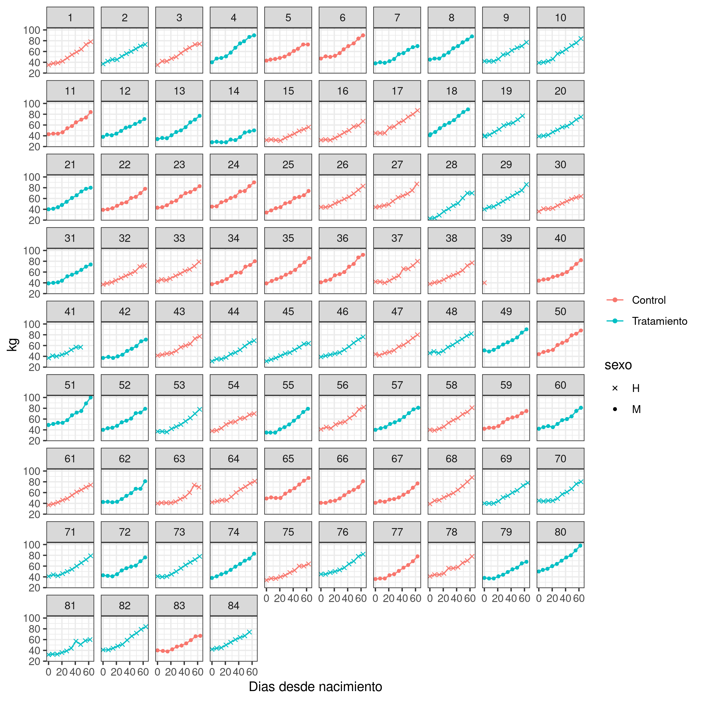

```{r setup, include=FALSE}
knitr::opts_chunk$set(echo = F, warning = F, message = F)
```


```{r, eval =FALSE}
pacman::p_load(tidyverse, googlesheets4)
# gs4_deauth()
# gs4_auth(email = "evangelina.miqueo@gmail.com")
gs4_auth(email = "edwardsmolina@gmail.com")
# gs4_find("Resultados exp 1")

exp1 <- gs4_get("https://docs.google.com/spreadsheets/d/1VdxnM5covl_eGLaGrFNC0JHKE-9FFsf-7AWVi5ACURg/edit?usp=sharing")
# peso %>% sheet_names()
# exp1 %>% gs4_browse()
```

```{r}
pacman::p_load(tidyverse, googlesheets4)
load(here::here("exp1/data/dat_exp1.Rdata"))
```

· Nacimientos por mes / sexo

```{r}
dat %>% 
  count(trat, sexo, fecha_0 %>% lubridate::month()) %>% 
  ggplot()+ 
  aes(x=`fecha_0 %>% lubridate::month()`, n, fill = sexo, label =n)+ 
  geom_bar(stat="identity", alpha=.4)+
  geom_text(size = 3, position = position_stack(vjust = 0.5))+ 
  facet_grid("trat") + 
  theme_bw()+
  labs(x= "Mes de nacimiento")
```

· Peso al nacer

```{r}
dat %>% 
  # filter(kg_0>30) %>% 
  ggplot()+
  aes(trat, kg_0)+
  geom_jitter(width=.1, alpha=.3) +
  facet_grid(.~sexo)+
  stat_summary(fun=median, geom="crossbar", col="red")+
  stat_summary(aes(label=..y.. %>% round(2)), 
               fun=median, geom="text", size=4, 
               vjust = 0)+
  geom_text(aes(label=id_ternero), hjust=2, size=2)

```

```{r}
dat %>% glimpse

mod <- lm(kg_0 ~ trat * sexo, data=dat)
anova(mod)
summary(mod)

```


> No hay Hay efecto del tratamiento sobre el peso al nacimiento y si hay efecto del sexo. 

· Periodo de experimento por ternero

```{r}
library(ggstance)
```

```{r}
dat_long %>% 
  group_by(id_ternero) %>%
  summarise(trat=first(trat), 
            min = min(fecha),
            max = max(fecha), 
            fecha = first(fecha), 
            dias_tot = max(dias)) %>% 
  ggplot()+
  aes(lubridate::as_date(fecha), id_ternero)+
  geom_pointrangeh(aes(xmin = min, xmax = max), size=.1, alpha=.7)+ 
  facet_wrap("trat") + 
  geom_text(aes(x=max, y = id_ternero, label=dias_tot), size=2)+ 
  scale_x_date(date_breaks = "2 week",
               date_minor_breaks = "1 week", date_labels = "%b %d") +
  labs(x = "Fecha de nacimiento")+
  theme_bw() +
  theme(axis.text.x=element_text(angle=60, hjust=1))

```


```{r}
library(ggrepel)
```

## Evolución pesos segun fecha 

Nivel de ternero 

```{r, eval = FALSE}
dat_long %>%   
  ggplot()+
  aes(x=dias, y=kg, col=trat)+
  geom_path(aes(col=trat), alpha =.9)+
  geom_point(aes(shape=sexo), size=1.2)+
  scale_shape_manual(values=c(4, 16))+
  facet_wrap("id_ternero")+
  theme_bw()+
  scale_y_continuous(breaks = scales::pretty_breaks())+
  labs(col = "", x = "Dias desde nacimiento")
```

```{r, eval=FALSE}
ggsave(last_plot(), file = "plots/id_terneros.png", w=8, h=8)
```


{width=100%}

Segun tratamiento 

```{r, Out.width = "100%"}
dat_long %>%   
  # filter(semana<5) %>%
  # filter(!id_ternero %in% c(13,14,15,16, 28)) %>%
  ggplot()+
  aes(x=fecha, y=kg)+
  geom_line(aes(group=id_ternero), alpha =0.5)+
  geom_point(size=0.7)+
  facet_wrap(~trat)+
  theme_bw()+
  scale_y_continuous(breaks = scales::pretty_breaks())+
  geom_text_repel(aes(label = label),
                  nudge_x = 0.1,
                  na.rm = TRUE, 
                  size=2, col ="red")+ 
  labs(x="", col = "")+
  theme(axis.text.x=element_text(angle=60, hjust=1))+
  scale_x_date(date_breaks = "2 week",
               date_minor_breaks = "1 week", date_labels = "%b %d")
```


```{r, eval=FALSE}
ggsave(last_plot(), file = "plots/peso_terneros_fecha.png", w=6, h=4)

googledrive::drive_upload(path = googledrive::as_dribble("evanchi_phd"), "plots/peso_terneros_fecha.png", 
             overwrite = TRUE)
```


Sin terneros 13 a 16, 39 (muerto) 

```{r}
dat_long %>%  
  filter(!id_ternero %in% 13:16) %>% 
  filter(!id_ternero %in% 39) %>% 
  # filter(!id_ternero %in% 28) %>% 
  ggplot()+
  aes(x=dias, y=kg, col =trat)+
  geom_line(aes(group=id_ternero), alpha =.2)+
  geom_smooth()+
  facet_grid(tanda~sexo)+
  theme_bw()+
  scale_y_continuous(breaks = scales::pretty_breaks())+
  labs(x="", col = "")
```


# Ganancia de peso 

Según semana (del año) que nació

```{r}
dat_long %>% 
  # filter(!id_ternero %in% c(14,15,16, 28, 44,45)) %>%
  group_by(id_ternero) %>% 
  summarise(fecha_nac = first(fecha),
            trat = first(trat) , 
            sexo = first(sexo), 
            tanda = first(tanda),
            intervalo_dias = max(dias),
            peso_nac = min(kg),
            peso_fin = max(kg),
            delta_peso= peso_fin - peso_nac)  %>% 
  mutate(gpd = delta_peso/intervalo_dias) -> efic_dat
```


```{r}
efic_dat %>% 
  ggplot()+
  aes(x=lubridate::week(fecha_nac), y = gpd)+
  geom_point()+
  facet_grid(sexo~trat)+
  geom_text(aes(label=id_ternero), hjust=2, size=2)+
  geom_smooth(method= "lm")+
  labs(x = "Nacimiento - semana del año", 
       y = "Ganancia diaria de peso (kg/d)")

```

Sin terneros 13 a 16, 39 (muerto) 

```{r}
efic_dat %>% 
  filter(!id_ternero %in% 13:16) %>% 
  filter(!id_ternero %in% 39) %>% 
  ggplot()+
  aes(x=lubridate::week(fecha_nac), y = gpd)+
  geom_point()+
  facet_grid(sexo~trat)+
  geom_text(aes(label=id_ternero), hjust=2, size=2)+
  geom_smooth(method= "lm")+
  labs(x = "Nacimiento - semana del año", 
       y = "Ganancia diaria de peso (kg/d)")

```


```{r}
dat_long %>% 
  # filter(!id_ternero %in% c(14,15,16, 28, 44,45)) %>%
  group_by(id_ternero) %>% 
  mutate(intervalo_dias = dias - lag(dias),
         delta_kg= kg - lag(kg))  %>%  
  mutate(adg = delta_kg/intervalo_dias) %>% 
  # filter(!id_ternero %in% 13:16) %>% 
  filter(!id_ternero %in% 39) %>% 
  filter(!id_ternero %in% 41) %>% 
  filter(!dias == 0) %>% 
  mutate_at(vars(id_ternero, trat, sexo), as.factor) -> dat_adg
```

```{r}
library(lme4)
library(pbkrtest)
library(lmerTest)
```

Sin terneros 39 y 41 (muertos) 

```{r}
dat_adg %>%
  select(id_ternero, trat, sexo, semana, fecha, kg, dias_d_nac = dias, intervalo_dias, delta_kg, adg) %>% 
  head(n=15)
mod1 <- lmer(adg ~ trat * dias + (1+dias|id_ternero) + (1|sexo),
             data=dat_adg)
anova(mod1, ddf = "Kenward-Roger", type=3)
```


```{r}
efic_dat %>% 
  filter(!id_ternero %in% 13:16) %>% 
  filter(!id_ternero %in% 39) %>% 
  ggplot()+
  aes(x=lubridate::week(fecha_nac), y = gpd)+
  geom_point()+
  facet_grid(.~trat)+
  geom_text(aes(label=id_ternero), hjust=2, size=2)+
  geom_smooth(method= "lm")+
  labs(x = "Nacimiento - semana del año", 
       y = "Ganancia diaria de peso (kg/d)")
```


```{r}
efic_dat %>%
  ggplot()+
  aes(x=trat, y=gpd)+
  # geom_boxplot()+
  geom_jitter(size=0.7, width=.1)+
  facet_wrap(~sexo)+ 
  stat_summary(aes(label=round(..y..,2)), 
               fun=median, geom="text", size=4, 
               vjust = 0) + 
  stat_summary(fun=median, geom="crossbar", col="red")+
   labs(x = "", 
       y = "Ganancia diaria de peso (kg/d)")

```


```{r, eval =FALSE}
library(lme4)
library(nlme)
library(emmeans)
dat1 <- dat_long %>% 
  left_join(info %>% 
              select(id_ternero, Sexo), by = "id_ternero") 
dat1

m <- lmer(kg ~ trat * dias + Sexo + (1|id_ternero), data = dat1)
plot(m)
car::Anova(m)
em <- emmeans(m, "trat")
contrast(em)
contrast(em, adjust = "bonferroni")
em <- emmeans(m, c("age", "Sex"), at = list(dias = c(1, 14)))
contrast(em)
contrast(em, adjust = "bonferroni")
contrast(em, method = "pairwise")
```

